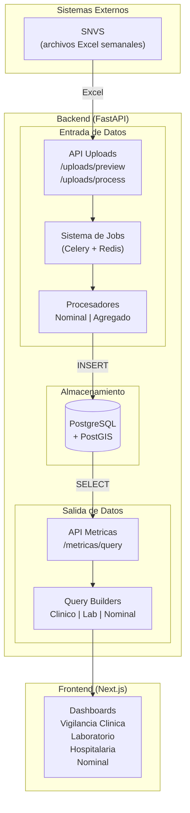

# Documentacion Tecnica del Backend

Esta carpeta contiene la documentacion de arquitectura del sistema de vigilancia epidemiologica.

## Vision General del Sistema



## Documentos

| Documento | Descripcion | Cuando leerlo |
|-----------|-------------|---------------|
| [arquitectura-procesamiento.md](arquitectura-procesamiento.md) | Como se cargan los datos del SNVS a la BD | Vas a modificar el upload de archivos o agregar un nuevo tipo de archivo |
| [sistema-metricas.md](sistema-metricas.md) | Como el frontend consulta datos agregados | Vas a agregar una nueva metrica, dimension, o dashboard |

## Flujo de Datos

```
Usuario sube Excel
        │
        ▼
┌─────────────────────────────────────────────────────────────┐
│  PROCESAMIENTO (arquitectura-procesamiento.md)              │
│                                                             │
│  1. POST /uploads/preview → detecta tipo, muestra preview   │
│  2. POST /uploads/process → crea Job, dispara Celery        │
│  3. Celery Worker ejecuta Procesador segun tipo             │
│  4. Procesador valida, transforma, inserta en BD            │
│  5. Frontend hace polling de estado hasta completar         │
└─────────────────────────────────────────────────────────────┘
        │
        ▼
   PostgreSQL (datos normalizados)
        │
        ▼
┌─────────────────────────────────────────────────────────────┐
│  METRICAS (sistema-metricas.md)                             │
│                                                             │
│  1. Frontend pide metrica + dimensiones + filtros           │
│  2. MetricService valida y selecciona QueryBuilder          │
│  3. Builder arma query SQL con JOINs necesarios             │
│  4. Ejecuta, post-procesa (derivadas, corredor endemico)    │
│  5. Retorna JSON listo para graficar                        │
└─────────────────────────────────────────────────────────────┘
        │
        ▼
  Dashboard muestra grafico/tabla
```

## Glosario

| Termino | Significado |
|---------|-------------|
| **SNVS** | Sistema Nacional de Vigilancia de la Salud |
| **CLI_P26** | Planilla 26 Clinica (casos agregados por semana) |
| **LAB_P26** | Planilla 26 Laboratorio (muestras por agente/tecnica) |
| **ETI** | Enfermedad Tipo Influenza |
| **Semana Epidemiologica** | Semana del 1 al 52/53, standard OMS |
| **Corredor Endemico** | Percentiles historicos para detectar brotes |
