# Arquitectura de Procesamiento de Datos

> **Contexto:** Este sistema maneja la **entrada de datos** al sistema. Los archivos Excel del SNVS (Sistema Nacional de Vigilancia de la Salud) se procesan aqui y se guardan en la base de datos. Una vez procesados, los datos estan disponibles para consulta via el [Sistema de Metricas](sistema-metricas.md).

## Que problema resuelve?

El Ministerio de Salud recibe semanalmente archivos Excel con datos de vigilancia epidemiologica:
- **Vigilancia Nominal**: Casos individuales con datos del paciente (~100 columnas)
- **Vigilancia Agregada**: Conteos semanales por establecimiento (CLI_P26, LAB_P26)

Estos archivos pueden tener miles de filas. Procesarlos de forma sincrona bloquearia la interfaz. Este sistema:
1. Recibe el archivo y muestra un preview inmediato
2. Procesa en background (Celery) sin bloquear al usuario
3. Reporta progreso en tiempo real via polling

---

## Vision General


---

El sistema de procesamiento de archivos sigue una arquitectura modular y asincrona que permite procesar grandes volumenes de datos sin bloquear la interfaz de usuario.

## Diagrama General de Flujo


## Arquitectura de Módulos

```mermaid
graph TB
    subgraph api ["📁 app/api/v1/uploads"]
        preview["preview_file.py<br/>Analiza archivo sin procesar"]
        process["process_from_preview.py<br/>Inicia procesamiento"]
        status["get_job_status.py<br/>Consulta estado"]
        cancel["cancel_job.py<br/>Cancela job"]
    end

    subgraph jobs ["📁 app/domains/jobs"]
        models["models.py<br/>Job (modelo genérico)"]
        tasks["tasks.py<br/>execute_job (Celery)"]
        registry["registry.py<br/>Processor Registry"]
        services["services.py<br/>JobService"]
    end

    subgraph nominal ["📁 app/domains/vigilancia_nominal"]
        n_handler["upload_handler.py<br/>NominalUploadHandler"]
        n_processor["processor.py<br/>SimpleEpidemiologicalProcessor"]
        n_bulk["bulk/main.py<br/>MainProcessor"]
        n_validator["validator.py<br/>OptimizedDataValidator"]
    end

    subgraph agregada ["📁 app/domains/vigilancia_agregada"]
        a_handler["upload_handler.py<br/>AgregadaUploadHandler"]
        a_processor["processor.py<br/>AgregadaProcessor"]
        a_types["types/<br/>CLIP26, LabP26..."]
        a_columns["columns/<br/>ColumnRegistry"]
    end

    preview --> process
    process --> n_handler
    process --> a_handler
    n_handler --> services
    a_handler --> services
    services --> models
    services --> tasks
    tasks --> registry
    registry -.-> n_processor
    registry -.-> a_processor
    n_processor --> n_bulk
    n_processor --> n_validator
    a_processor --> a_types
    a_types --> a_columns
    status --> services
```



## Flujo Detallado de Procesamiento


## Registry Pattern (Desacoplamiento)

El sistema usa un patrón Registry para desacoplar el módulo `jobs` de los procesadores específicos:


**Código:**
```python
# En vigilancia_nominal/__init__.py
from app.domains.jobs.registry import register_processor
register_processor("vigilancia_nominal", crear_procesador)

# En tasks.py
processor_factory = get_processor(job.processor_type)
processor = processor_factory(session, callback_progreso)
```

## Tipos de Archivos Soportados

| Tipo | Detectado por | Procesador | Datos generados |
|------|---------------|------------|-----------------|
| **NOMINAL** | Columnas de vigilancia nominal (100+) | `SimpleEpidemiologicalProcessor` | Ciudadanos, Casos, Diagnósticos |
| **CLI_P26** | `ID_AGRP_CLINICA` | `CLIP26Processor` | NotificacionSemanal, ConteoCasosClinicos |
| **CLI_P26_INT** | `ID_AGRP_CLINICA` + keywords internación | `CLIP26IntProcessor` | NotificacionSemanal, ConteoCamasIRA |
| **LAB_P26** | `ID_AGRP_LABO` | `LabP26Processor` | NotificacionSemanal, ConteoEstudiosLab |

## Pipeline de Vigilancia Nominal

```mermaid
flowchart LR
    subgraph "SimpleEpidemiologicalProcessor"
        L["1. Cargar<br/>(5%)"] --> V["2. Validar<br/>(10%)"]
        V --> C["3. Limpiar<br/>(15%)"]
        C --> CL["4. Clasificar<br/>(20%)"]
        CL --> S["5. Guardar<br/>(25-95%)"]
    end

    subgraph "MainProcessor (Bulk)"
        S --> E["Establecimientos"]
        E --> CI["Ciudadanos"]
        CI --> CA["Casos Epidemiológicos"]
        CA --> P1["Salud ‖"]
        CA --> P2["Diagnósticos ‖"]
        CA --> P3["Investigaciones ‖"]
    end
```



## Pipeline de Vigilancia Agregada


## Modelo de Datos: Job


## Modelo de Datos: Vigilancia Agregada


