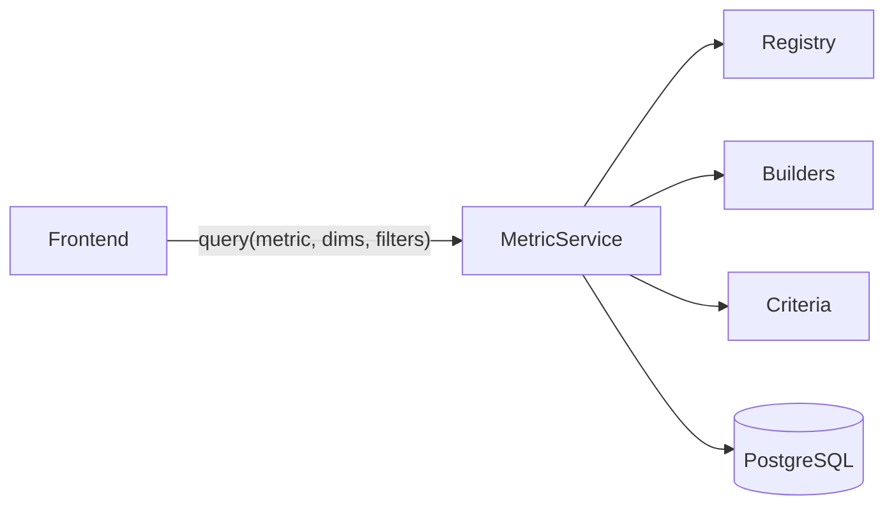

# Sistema de Metricas (BI Engine)

> **Contexto:** Este sistema maneja la **salida de datos**. Consulta la base de datos y devuelve metricas agregadas para los dashboards del frontend. Los datos fueron previamente cargados por el [Sistema de Procesamiento](arquitectura-procesamiento.md).

## Que problema resuelve?

El frontend necesita mostrar metricas epidemiologicas de distintas fuentes (clinica, laboratorio, hospitalaria, nominal). Sin este sistema, cada dashboard tendria su propio endpoint con queries SQL hardcodeadas.

Este sistema:
1. Unifica todas las consultas en una sola API (`POST /metricas/query`)
2. Permite combinar cualquier metrica con cualquier dimension permitida
3. Calcula metricas derivadas (ej: tasa de positividad) automaticamente

---

## Arquitectura General

```
app/domains/metricas/
├── service.py              # MetricService - Punto de entrada (Facade)
├── builders/               # Query Builders por fuente de datos
│   ├── base.py             # MetricQueryBuilder (abstracto)
│   ├── clinico.py          # Vigilancia clinica (CLI_P26)
│   ├── laboratorio.py      # Laboratorio (LAB_P26)
│   ├── hospitalario.py     # Ocupacion hospitalaria
│   └── nominal.py          # Casos individuales
├── criteria/               # Sistema de filtros componibles
│   ├── base.py             # Criterion + AND/OR
│   ├── temporal.py         # Filtros de tiempo
│   ├── evento.py           # Filtros de evento/agente
│   └── geografico.py       # Filtros geograficos
├── registry/               # Catalogos de definiciones
│   ├── metrics.py          # METRICS dict
│   └── dimensions.py       # DIMENSIONS dict (solo metadata)
└── schema/
    └── cubes.py            # Schema BI para frontend
```

### Patrones Utilizados

| Patron         | Donde                            | Que hace                                              |
| -------------- | -------------------------------- | ----------------------------------------------------- |
| **Facade**     | `MetricService`                  | Punto de entrada unico, oculta complejidad interna    |
| **Builder**    | `*QueryBuilder`                  | Construye queries SQL de forma fluida                 |
| **Criteria**   | `Criterion` y subclases          | Filtros componibles con `&` y `\|`                    |
| **Registry**   | `METRICS`, `DIMENSIONS`          | Catalogo centralizado de definiciones                 |

#### Que es Facade?

`MetricService` es una **fachada**: en vez de que el frontend coordine multiples subsistemas (registry, builders, criterios), llama a un solo metodo que hace todo internamente.



---

## Metricas Disponibles

| Codigo                | Source       | Agregacion      | Descripcion                    |
| --------------------- | ------------ | --------------- | ------------------------------ |
| `casos_clinicos`      | CLINICO      | SUM(cantidad)   | Casos vigilancia pasiva CLI_P26|
| `muestras_estudiadas` | LABORATORIO  | SUM(estudiadas) | Muestras procesadas LAB_P26    |
| `muestras_positivas`  | LABORATORIO  | SUM(positivas)  | Muestras con resultado positivo|
| `tasa_positividad`    | LABORATORIO  | **DERIVED**     | positivas/estudiadas * 100     |
| `casos_nominales`     | NOMINAL      | COUNT(*)        | Casos individuales             |
| `ocupacion_camas_ira` | HOSPITALARIO | SUM(cantidad)   | Camas ocupadas por IRA         |

---

## Dimensiones por Source

No todas las dimensiones aplican a todas las metricas:

| Dimension               | Clinico | Lab | Nominal | Hospitalario |
| ----------------------- | :-----: | :-: | :-----: | :----------: |
| `SEMANA_EPIDEMIOLOGICA` |    ✓    |  ✓  |    ✓    |      ✓       |
| `ANIO_EPIDEMIOLOGICO`   |    ✓    |  ✓  |    ✓    |      ✓       |
| `TIPO_EVENTO`           |    ✓    |  -  |    ✓    |      ✓       |
| `AGENTE_ETIOLOGICO`     |    -    |  ✓  |    -    |      -       |
| `GRUPO_ETARIO`          |    ✓    |  ✓  |    ✓    |      ✓       |
| `SEXO`                  |    ✓    |  -  |    ✓    |      ✓       |
| `PROVINCIA`             |    ✓    |  ✓  |    ✓    |      ✓       |
| `DEPARTAMENTO`          |    ✓    |  ✓  |    ✓    |      ✓       |
| `ESTABLECIMIENTO`       |    ✓    |  -  |    -    |      ✓       |

**Nota:** Las dimensiones son solo metadata (label, descripcion). El mapeo a columnas SQL lo define cada builder en `get_dimension_column()`.

---

## Criterios (Filtros)

Los criterios son componibles con `&` (AND) y `|` (OR):

```python
criteria = (
    RangoPeriodoCriterion(2025, 1, 2025, 10) &
    TipoEventoCriterion(nombre="ETI") &
    ProvinciaCriterion(ids=[6])
)
```

### Criterios Disponibles

**Temporales:**

| Criterio                  | Parametros                                      |
| ------------------------- | ----------------------------------------------- |
| `RangoPeriodoCriterion`   | `anio_desde`, `semana_desde`, `anio_hasta`, `semana_hasta` |
| `AniosMultiplesCriterion` | `anios: list[int]`                              |

**Eventos:**

| Criterio                     | Parametros              |
| ---------------------------- | ----------------------- |
| `TipoEventoCriterion`        | `ids`, `nombre`, `slug` |
| `AgenteCriterion`            | `ids`, `nombre`         |
| `AgrupacionAgentesCriterion` | `ids`, `slug`           |

**Geograficos:**

| Criterio                   | Parametros       |
| -------------------------- | ---------------- |
| `ProvinciaCriterion`       | `ids`, `nombre`  |
| `DepartamentoCriterion`    | `ids`, `nombre`  |
| `EstablecimientoCriterion` | `ids`, `nombre`  |

---

## API REST

### Endpoints

| Metodo | Endpoint                | Descripcion                    |
| ------ | ----------------------- | ------------------------------ |
| GET    | `/metricas/disponibles` | Lista metricas y dimensiones   |
| GET    | `/metricas/schema`      | Schema completo para BI        |
| POST   | `/metricas/query`       | Ejecutar query                 |

### Ejemplos de Request

**Casos de ETI por semana:**

```json
{
  "metric": "casos_clinicos",
  "dimensions": ["SEMANA_EPIDEMIOLOGICA"],
  "filters": {
    "periodo": {
      "anio_desde": 2025, "semana_desde": 1,
      "anio_hasta": 2025, "semana_hasta": 20
    },
    "evento_nombre": "ETI"
  }
}
```

**Distribucion por agente:**

```json
{
  "metric": "muestras_positivas",
  "dimensions": ["AGENTE_ETIOLOGICO", "SEMANA_EPIDEMIOLOGICA"],
  "filters": {
    "periodo": {
      "anio_desde": 2025, "semana_desde": 1,
      "anio_hasta": 2025, "semana_hasta": 10
    }
  }
}
```

**Corredor endemico:**

```json
{
  "metric": "casos_clinicos",
  "dimensions": ["SEMANA_EPIDEMIOLOGICA", "ANIO_EPIDEMIOLOGICO"],
  "filters": {
    "periodo": {
      "anio_desde": 2020, "semana_desde": 1,
      "anio_hasta": 2025, "semana_hasta": 52
    },
    "evento_nombre": "ETI"
  },
  "compute": "corredor_endemico"
}
```

---

## Como Agregar...

### Nueva Metrica

Agregar en `registry/metrics.py`:

```python
METRICS["mi_metrica"] = MetricDefinition(
    code="mi_metrica",
    label="Mi Metrica",
    description="Descripcion para UI",
    source=MetricSource.CLINICO,
    model=MiModelo,
    aggregation=AggregationType.SUM,
    field_getter=lambda: MiModelo.mi_columna,
    allowed_dimensions=[DimensionCode.SEMANA_EPIDEMIOLOGICA, ...],
)
```

Listo, aparece automaticamente en la API.

### Nueva Dimension

1. Agregar codigo en `registry/dimensions.py`:

```python
class DimensionCode(str, Enum):
    MI_DIMENSION = "MI_DIMENSION"

DIMENSIONS[DimensionCode.MI_DIMENSION] = DimensionDefinition(
    code=DimensionCode.MI_DIMENSION,
    label="Mi Dimension",
    description="Descripcion para UI",
)
```

2. Agregar mapeo en cada builder que la soporte:

```python
# En builders/clinico.py
def get_dimension_column(self, dim_code: DimensionCode):
    return {
        # ... existentes
        DimensionCode.MI_DIMENSION: MiModelo.columna,
    }[dim_code]
```

3. Agregar a `allowed_dimensions` de las metricas relevantes.

### Nuevo Criterio

1. Crear en `criteria/`:

```python
@dataclass
class MiCriterion(Criterion):
    ids: list[int] | None = None
    nombre: str | None = None

    def to_expression(self) -> BinaryExpression | None:
        if self.ids:
            return MiModelo.id.in_(self.ids)
        elif self.nombre:
            return MiModelo.nombre.ilike(f"%{self.nombre}%")
        return None
```

2. Usar: `criteria = RangoPeriodoCriterion(...) & MiCriterion(ids=[1, 2])`

---

## Notas Tecnicas

- **Lazy Joins (Nominal):** Solo hace JOINs segun las dimensiones/criterios activos
- **GRUPO_ETARIO no estandarizado:** Agregados usan 19 rangos detallados, Nominal calcula 10 rangos
- **Metricas derivadas:** Se calculan post-query (ej: tasa_positividad = positivas/estudiadas)
