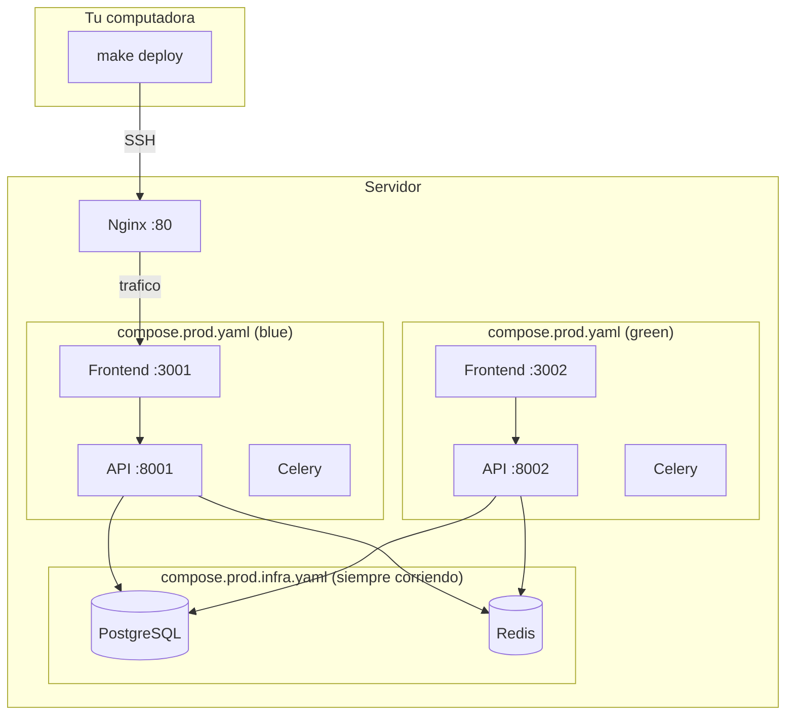

# Guia de Deploy

## ¿Que es esto?

Un sistema para actualizar la aplicacion en el servidor **sin que los usuarios noten que se esta actualizando** (zero downtime).

## Arquitectura



### Archivos Docker Compose

| Archivo | Que hace | Cuando se usa |
|---------|----------|---------------|
| `compose.yaml` | Dev: DB + Redis + pgweb con puertos expuestos | `make up` en tu maquina |
| `compose.prod.infra.yaml` | Prod: DB + Redis (sin puertos, red interna) | Deploy - siempre corriendo |
| `compose.prod.yaml` | Prod: Frontend + API + Celery | Deploy - blue o green |

### Como funciona blue/green

1. Tenes dos copias de la app: **blue** (puertos 3001/8001) y **green** (puertos 3002/8002)
2. Solo una recibe trafico (la "activa")
3. Para actualizar:
   - Levantas la copia inactiva con el nuevo codigo
   - Verificas que funcione
   - Nginx cambia el trafico a la nueva
   - Apagas la vieja
4. Los usuarios nunca ven downtime

> **Nota:** "blue" y "green" son solo nombres arbitrarios, no hay uno principal y otro secundario. Ambos son produccion y se van alternando con cada deploy. Podrian llamarse "A" y "B" - es solo una convencion de la industria.

## Configuracion

### 1. Crear archivo de configuracion

```bash
cp .env.deploy.example .env.deploy
```

Editar `.env.deploy`:

```bash
# Nombre de la app (para containers, volumenes, etc)
APP_NAME=epidemiologia

# Conexion SSH al servidor
SSH_HOST=192.168.1.100
SSH_USER=tu_usuario
SSH_PORT=22

# Base de datos
DB_NAME=epidemiologia_db
DB_USER=epidemiologia_user
DB_PASSWORD=password_seguro_aqui

# Seguridad (generar con: openssl rand -hex 32)
SECRET_KEY=clave_secreta_aqui

# URLs del servidor
NEXT_PUBLIC_API_HOST=http://192.168.1.100/api
FRONTEND_URL=http://192.168.1.100
CORS_ORIGINS=http://192.168.1.100
ALLOWED_HOSTS=192.168.1.100,localhost
```

### 2. Setup del servidor (solo una vez)

```bash
# Crear directorios en el servidor
make deploy-setup
```

Luego conectate al servidor:

```bash
make deploy-ssh
```

Y ejecuta estos comandos:

```bash
# Crear deploy key para GitHub
ssh-keygen -t ed25519 -f ~/.ssh/deploy_key -N ""
cat ~/.ssh/deploy_key.pub
# ^ Agregar esta clave en GitHub: Repo > Settings > Deploy keys

# Configurar SSH para usar la clave
cat >> ~/.ssh/config << 'EOF'
Host github.com
    IdentityFile ~/.ssh/deploy_key
    IdentitiesOnly yes
EOF

# Clonar el repositorio
cd /opt/epidemiologia  # o donde hayas configurado REMOTE_DIR
git clone git@github.com:tu-org/tu-repo.git app

# Instalar y configurar Nginx
sudo apt update && sudo apt install -y nginx
sudo cp /opt/epidemiologia/app/infra/nginx.conf /etc/nginx/sites-enabled/epidemiologia.conf
sudo nginx -t && sudo systemctl reload nginx

# Salir
exit
```

### 3. Primer deploy

```bash
make deploy
```

## Uso diario

### Comandos disponibles

| Comando | Que hace |
|---------|----------|
| `make deploy` | Deploy al servidor (blue/green) |
| `make deploy-rollback` | Volver a la version anterior |
| `make deploy-status` | Ver que esta corriendo |
| `make deploy-logs` | Ver logs del servidor |
| `make deploy-ssh` | Conectarse al servidor |

### Deploy normal

```bash
make deploy
```

Output:

```
>>> Conectando a usuario@192.168.1.100...
[OK] Conexion SSH
>>> Activo: blue -> Deployando: green (puertos 3002/8002)
>>> Subiendo .env...
>>> Ejecutando deploy...

1/7 Bajando cambios del repositorio...
2/7 Construyendo nuevas imagenes (esto puede tardar unos minutos)...
3/7 Levantando infraestructura (DB, Redis)...
4/7 Levantando aplicacion (green)...
5/7 Verificando que la aplicacion responda...
    OK - La aplicacion responde correctamente
6/7 Aplicando migraciones de base de datos...
7/7 Cambiando trafico a la nueva version...

Apagando version anterior (blue)...
Limpiando imagenes viejas...

[OK] Deploy completado - Ambiente activo: green
```

## Si algo sale mal

### El deploy fallo a mitad de camino

No pasa nada. La version anterior sigue funcionando.

```bash
make deploy
```

### La nueva version tiene un bug

```bash
make deploy-rollback
```

Esto vuelve automaticamente a la version anterior.

### Ya arregle el bug despues del rollback

```bash
# Commitear el fix
git add . && git commit -m "fix: ..." && git push

# Deployar de nuevo (va al ambiente que tenia el bug, ahora con el fix)
make deploy
```

### No me puedo conectar al servidor

```bash
# Probar conexion manual
ssh tu_usuario@192.168.1.100

# Verificar que .env.deploy tenga los datos correctos
cat .env.deploy
```

## Estructura en el servidor

```
/opt/epidemiologia/           # REMOTE_DIR
├── active_env                # Archivo que dice "blue" o "green"
└── app/                      # Repositorio clonado
    ├── .env                  # Variables de produccion (generado por deploy)
    ├── compose.prod.yaml     # App (frontend, api, celery)
    ├── compose.prod.infra.yaml # Infraestructura (db, redis)
    └── ...
```

## Glosario

| Termino | Que significa |
|---------|---------------|
| **Deploy** | Subir una nueva version de la aplicacion al servidor |
| **Blue/Green** | Tecnica de tener dos copias para actualizar sin cortes |
| **Nginx** | Programa que recibe las peticiones y las manda a la app |
| **Docker Compose** | Herramienta para definir y correr aplicaciones multi-contenedor |
| **Health check** | Verificar que la aplicacion responde antes de mandar usuarios |
| **SSH** | Protocolo para conectarse de forma segura a un servidor |
| **Deploy key** | Clave SSH especifica para un repositorio (no asociada a una persona) |
| **Rollback** | Volver a la version anterior de la aplicacion |
